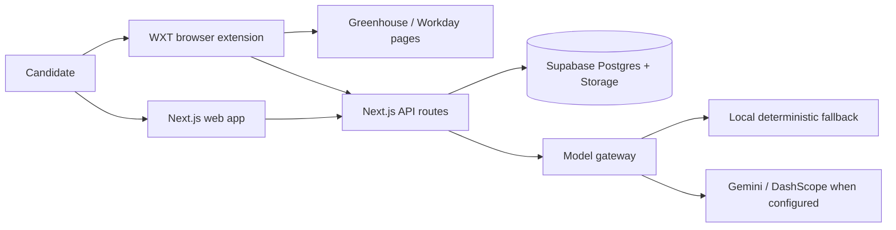

# AutoApply

AutoApply is a personal application operations system: a Next.js web app plus browser extension that helps a candidate keep evidence-backed profile data, analyze jobs, generate reviewable resume strategy, and safely fill ATS forms with human approval.

The repository is intentionally small at the top level: `apps/web` is the Next.js product, `apps/extension` is the browser extension, and `supabase` contains the local database schema.

## Product Overview

AutoApply is built around a simple rule: automate the busywork, but keep the applicant in control. The web app stores application profiles, uploaded documents, evidence chunks, extracted professional claims, job analyses, generated artifacts, and application pipeline state. The extension detects supported ATS pages, previews mapped fields, fills only after confirmation, uploads documents through signed URLs, and tracks application state back to the web app.

Current supported surfaces:

- Web app: Next.js App Router, Supabase auth/database/storage, Vitest component/API tests, Playwright e2e setup.
- Extension: WXT Chrome extension, Greenhouse scanner/mapper/filler, Workday detection shell, local profile sync.
- Knowledge workflow: document ingestion, model-gateway-backed embeddings/extraction, provenance links from claims to evidence chunks, draft resume strategy/artifacts.

## Engineering Highlights

- Production-style API boundaries: 39 App Router API routes with auth checks, Zod validation on critical ingestion flows, and Supabase row-level user boundaries.
- Reliability-first extension workflow: field scanning, deterministic mapping, per-field fill results, skipped/error states, file upload handling, duplicate application detection, and explicit preview before fill.
- Idempotent application tracking: extension tracking checks existing `user_id + apply_url` records before write, uses the database unique index/upsert path for duplicate prevention, and returns replay metadata for duplicate calls.
- Evidence-grounded AI workflow: model gateway isolates provider calls from repository logic, stores extraction/embedding provenance, and keeps generated claims/artifacts in draft/reviewable states.
- Testable system design: 87 test files currently cover web APIs, schema validation, knowledge ingestion, model gateway fallback behavior, extension scanner/mapper/filler behavior, auth helpers, and UI components.
- Practical observability: critical extension tracking now emits structured server logs with event names, application ids, and non-sensitive workflow flags.

## Stripe-Relevant Systems Work

- APIs: authenticated REST-like Next.js route handlers for applications, profiles, job analyses, knowledge ingestion, generated artifacts, Gmail ingestion hooks, and extension integration.
- Idempotency/retries: application tracking combines preflight duplicate reads, a `user_id,apply_url` unique index, upsert conflict handling, replay response metadata, and extension-side retry-friendly calls.
- Observability: application tracking emits structured `autoapply.extension.track_application` events for create/upsert and idempotent replay paths.
- Extension messaging: background/content/popup boundaries use typed message contracts for auth, profile sync, field mappings, fill start, signed URL retrieval, duplicate checks, and application status updates.
- Product feedback loops: knowledge ingestion exposes extracted claims, source chunks, entities, confidence, and overclaim guardrails so a human can inspect model output before trusting it.

## Reliability and Safety

- Human-in-the-loop review: the extension shows field mappings before fill; generated artifacts and extracted claims remain draft/reviewable rather than silently trusted.
- No silent submission: the extension fills forms after confirmation but does not submit applications on behalf of the user. Submission detection only updates local application status after the user submits.
- RLS boundaries: Supabase migrations enable row-level security across application, profile, knowledge graph, artifact, answer, validation, and networking tables.
- PII handling: profile PDFs are stored in the private `profile-documents` Supabase bucket and fetched with short-lived signed URLs. PII encryption support exists through `PII_ENCRYPTION_KEY` and pgcrypto-backed profile helpers.
- Validation: API inputs use Zod schemas where the workflow is high risk, including profile/identity and knowledge ingestion surfaces.
- Duplicate prevention: application tracking uses `apply_url` duplicate checks, unique indexes, and idempotent replay responses.
- Auditability: knowledge claims store evidence links, chunk references, extraction provider/model metadata, embedding provider/model metadata, confidence, and overclaim guardrails.

## Architecture

At a high level:



## Repo Structure

```text
.
├── README.md
├── SECURITY.md
├── .github/workflows/ci.yml
├── apps/web/          # Next.js app, API routes, UI, tests
├── apps/extension/    # WXT browser extension, scanner/filler, tests
├── scripts/           # Development checks
├── supabase/          # Local Supabase config and migrations
├── package.json       # npm workspace root
└── package-lock.json
```

## Setup

Prerequisites:

- Node.js 22.13.0 or newer
- npm
- Supabase CLI, if running the local database

Install:

```bash
nvm use
npm install
cp .env.example apps/web/.env.local
```

Fill in safe local values in `apps/web/.env.local`. Do not commit `.env`, `.env.local`, API keys, resumes, screenshots with private data, or generated application artifacts.

## Environment Variables

See [`.env.example`](.env.example) for safe placeholders.

Important variables:

- `NEXT_PUBLIC_WEBAPP_URL`: local web app URL.
- `NEXT_PUBLIC_SUPABASE_URL`, `NEXT_PUBLIC_SUPABASE_ANON_KEY`: browser-safe Supabase config.
- `SUPABASE_SERVICE_ROLE_KEY`: server-only service key.
- `ENABLE_DEV_LOGIN`, `DISABLE_AUTH_BYPASS`: local-only auth development controls.
- `PII_ENCRYPTION_KEY`: server-only key for encrypted PII helpers.
- `KNOWLEDGE_EMBEDDING_PROVIDER`: `local`, `gemini`, or `dashscope`.
- `KNOWLEDGE_EXTRACTION_PROVIDER`: currently local fallback plus DashScope/Qwen path when configured.

## Local Development

```bash
npm run dev
```

Run the extension during development:

```bash
npm run dev --workspace=apps/extension
```

Run Supabase locally when database-backed flows are needed:

```bash
npx supabase start
```

## Testing

Use Node 22.13.0+:

```bash
npm run test:web
npm run test:extension
npm run lint --workspace=apps/web
npm exec --workspace=apps/web -- tsc --noEmit --pretty false --types vitest/globals
npm exec --workspace=apps/extension -- wxt prepare
npm exec --workspace=apps/extension -- tsc --noEmit --pretty false
```

The GitHub Actions workflow runs install, web typecheck, web lint, web tests, WXT type generation, extension typecheck, and extension tests from the repository root.

## Privacy And Security

See [`SECURITY.md`](SECURITY.md). This repo is designed for sensitive job-search data, so keep private resumes, local screenshots, Supabase dumps, and generated application artifacts out of git.

## Roadmap

- Add explicit approve/reject workflow for extracted professional claims before they can power final artifacts.
- Add semantic retrieval over 512-dimensional evidence/claim embeddings.
- Upgrade resume artifacts from deterministic TeX scaffolds to evidence-grounded, validated outputs.
- Add a small evaluation suite for extraction quality, retrieval relevance, and overclaim prevention.
- Expand extension support beyond Greenhouse with the same preview-first safety model.
